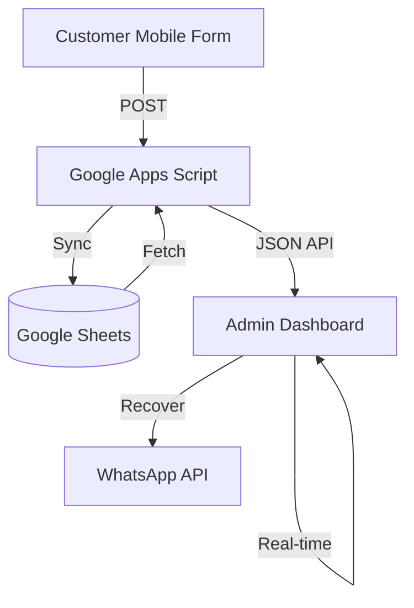

# 🐾 Cat Cafe Insights: Full-Stack Modernization

A professional, production-ready feedback collection and analysis system. This project features a high-performance **Google Apps Script (GAS)** backend and a state-of-the-art **Bento Grid** admin dashboard.

## 🌟 Key Features

### 📊 Modern Admin Dashboard (Bento Grid)
- **High-Performance Analytics**: Serverless architecture using GAS for sub-second data retrieval.
- **Asymmetric Bento Layout**: Premium, mobile-responsive layout for optimized data visualization.
- **AI-Driven Summaries**: Real-time business performance summaries in clear, professional English.
- **Customer Recovery**: One-click WhatsApp integration to recover low-rated customers.
- **Interactive Reports**: Detailed operational radar charts and discovery source breakdowns.
- **Printable QR System**: Dedicated page for generating branded, table-ready feedback QR codes.

### 📱 Customer Feedback Form
- **Production-Grade UI**: Polished, mobile-first design with smooth transitions and validations.
- **Instant Synchronization**: Zero-latency routing to Google Sheets for immediate action.

## 🛠 Tech Stack

- **Frontend**: React 19, TypeScript, Tailwind CSS 4, Framer Motion, Recharts, Lucide React.
- **Backend**: Google Apps Script (Serverless Web App).
- **Database**: Google Sheets (as a real-time BI data source).
- **UI/UX**: Bento Grid Design System, Skeleton Loading, Staggered Animations.

## 🏗 Architecture



## 🚀 Environment Setup

### 1. Backend (Google Apps Script)
1. Copy the code from `scratch/Code.gs` into a new GAS Project.
2. Deploy as a **Web App** (Execute as: Me, Access: Anyone).
3. Copy the Web App URL.

### 2. Admin Dashboard
1. Create a `.env` file in the `admin/` directory.
2. Add the following variables:
   ```env
   VITE_API_URL=https://script.google.com/macros/s/.../exec
   VITE_ADMIN_KEY=your_secure_key
   ```
3. Run `npm install` and `npm run dev`.

## 📄 Operational Notes
- **Needs Attention**: Automatically flags reviews with an average score ≤ 3.0.
- **Data Protection**: Ensure `VITE_ADMIN_KEY` matches the `ADMIN_KEY` property in your GAS script settings.

## 📄 License
MIT
