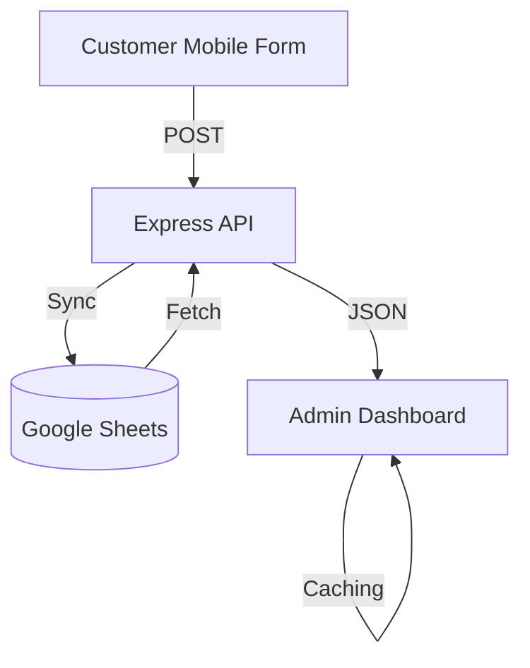

# 🐾 Cat Cafe Insights: Full-Stack Feedback Ecosystem

A professional, end-to-end feedback collection and analysis system designed for a Cat Cafe. This project demonstrates high-fidelity UI/UX, robust backend security, and real-time data orchestration using Google Sheets as a serverless database.

 <!-- Placeholder for screenshot -->

## 🌟 Key Features

### 📊 Admin Dashboard
- **Real-Time Analytics**: Live insights fetched from Google Sheets with in-memory caching.
- **Dynamic Visualizations**: Interactive charts for feedback volume, discovery sources, and performance metrics.
- **Sentiment Monitoring**: Automated tracking of top praises and critical areas needing improvement.
- **Premium UI**: Modern, responsive design featuring glassmorphism, floating paw animations, and skeleton loaders.

### 📱 Customer Feedback Form
- **Mobile-First Experience**: Highly interactive, touch-friendly form for seamless customer submissions.
- **Automated Sync**: Submissions are instantly routed to Google Sheets for immediate visibility.
- **Offline Resilience**: Local logging fallback in case of API downtime.

### 🔒 Enterprise-Grade Backend
- **Security Hardened**: Implements `helmet` security headers and strict `express-rate-limit` policies.
- **Robust Auth**: Advanced Google Service Account credential sanitization for zero-fail deployments.
- **Deep Diagnostics**: Comprehensive logging for production troubleshooting.

## 🛠 Tech Stack

- **Frontend**: React 18, TypeScript, Tailwind CSS, Vite, Recharts, Lucide React.
- **Backend**: Node.js, Express, Google APIs, Helmet, Morgan.
- **Data**: Google Sheets API (used as a real-time database).
- **Deployment**: Vercel (Frontend), Render (Backend).

## 🚀 Quick Start

### 1. Prerequisites
- Node.js (v18+)
- A Google Cloud Service Account with Google Sheets API enabled.

### 2. Backend Setup
```bash
cd backend
npm install
# Create .env with GOOGLE_CREDENTIALS and GOOGLE_SHEET_ID
npm start
```

### 3. Admin Setup
```bash
cd admin
npm install
# Create .env with VITE_API_URL
npm run dev
```

## 🏗 Architecture



## 📈 Future Roadmap
- [ ] **PDF Reporting**: One-click professional report generation.
- [ ] **AI Sentiment Analysis**: Automated categorization using NLP.
- [ ] **Multi-Location Support**: Unified dashboard for multiple cafe branches.

## 📄 License
MIT
